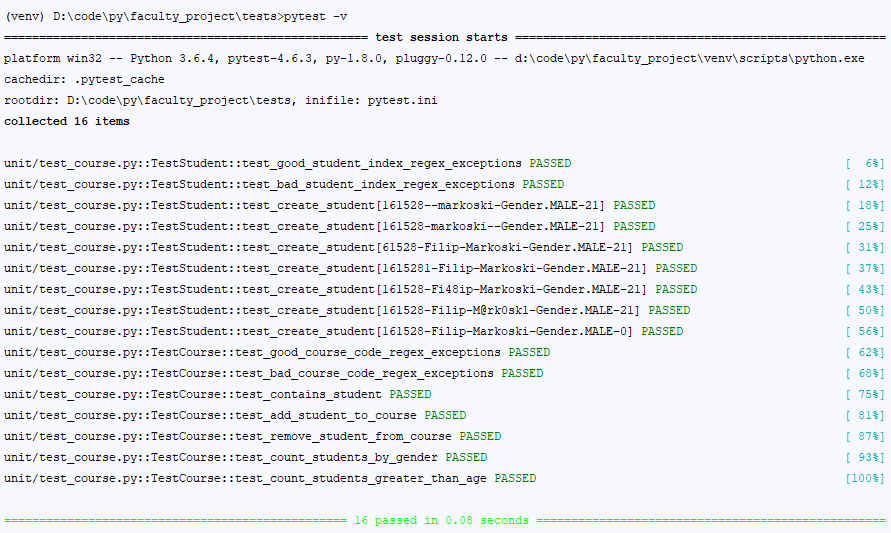

# `pytest` example project
### A project for the course Software Quality and Testing at FCSE, Skopje
#### Made by:  161528, Филип Маркоски



After making the virtual environemt (python 3.6) I ran the following commands

```pip freeze
pip -V
easy_install -U pip
pip -V
pip freeze
pip install -r requirements.txt
ls
pip install
pip install .
cd tests
cd unit
pytest
cd ..
git init .
git remote add origin https://github.com/filipmarkoski45/faculty_project.git
git status
git branch
git push -u origin master